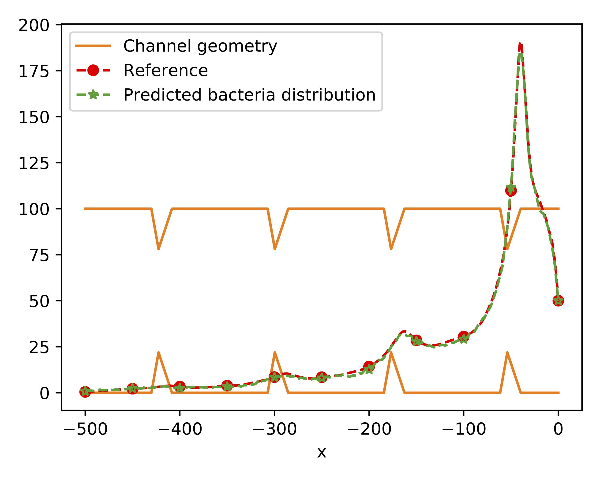

# AI-aided Geometric Design of Anti-infection Catheters

Bacteria can swim upstream due to hydrodynamic interactions with the fluid flow
in a narrow tube, and pose a clinical threat of urinary tract infection to
patients implanted with catheters. Coatings and structured surfaces have been proposed as a way to suppress bacterial contamination in catheters. However, there is no surface structuring or coating approach to date that thoroughly addresses the contamination problem. Here, based on the physical mechanism of upstream swimming, we propose a novel geometric design, optimized by an AI model predicting in-flow bacterial dynamics. The AI method, based on Fourier neural operator, offers significant speedups over traditional simulation methods. Using Escherichia coli, we demonstrate the anti-infection mechanism in quasi-2D micro-fluidic experiments and evaluate the effectiveness of the design in 3D-printed prototype catheters under clinical flow rates. Our catheter design shows 1-2 orders of magnitude improved suppression of bacterial contamination at the upstream end of the catheter, potentially prolonging the in-dwelling time for catheter use and reducing the overall risk of catheter-associated urinary tract
infections.

**This repo presents the data and scripts used for the AI-aided design optimization.**

## Data

The data sets are XXXX, which contain 8 `*.npy` files:
1. x_1d_structured_mesh.npy : grid x coordinate (2001 by 3n_data array)
2. y_1d_structured_mesh.npy : grid y coordinate (2001 by 3n_data array)
3. data_info.npy : data information, including sample, uf, L_p, x1, x2, x3, h (7 by 3n_data array)
4. density_1d_data.npy : bacteria distribution function (2001 by 3n_data array)

The data are stored as nx by ny by ndata arrays (2d problems) or nx by ndata arrays (1d problems).

## Results
### Training and test errors, and verification on some test cases

### Real-time design optimization
<video src="https://user-images.githubusercontent.com/16932196/232146051-5453088f-57d4-49ba-9aca-1ce4c914b29e.mp4" controls="controls" style="max-width: 400px;">
</video>

### Verification of the final optimal design

More details are in the paper:  Tingtao Zhou, Xuan Wan, Daniel Zhengyu Huang,
Zongyi Li, Zhiwei Peng, Anima Anandkumar, John F. Brady, Paul W. Sternberg, Chiara Daraio. "[AI-aided Geometric Design of Anti-infection Catheters](https://arxiv.org/abs/2203.13181)."

## Code structure 

Each application has one folder, which includes the PDE solver and different NN training folders including `PCA`,  `DeepONet`, `PARA` and `FNO`.
    
    1. `data_preprocess.ipynb`: Raw data is generated by coupled fluid particle simulations. This script preprocess the raw data to training/test data, including the 500-$\mu m$ long channel geometry and bacteria distribution in this area at T = 500s.  

    2. `geofno_train.ipynb`: Train the Geo-FNO model, one trained model is `catheter_plain_length_model_1d1000`. 

    3. `catheter_design.ipynb`: Real-time design optimization by using Geo-FNO model and BFGS algorithm.
    
    4. `catheter_analysis.ipynb`: Compassion with linear regression model; Visualization of the landscape of the loss function around the optimal design.

## Submit an issue
You are welcome to submit an issue for any questions related to AI-aided design optimization. 

